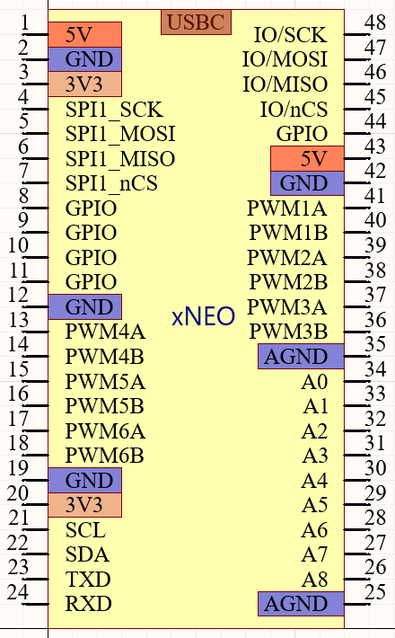

# xNeo Specs

[天在水](heguolin@mail.iee.ac.cn)@2022/04/29

## 目标

设计一种方便电控平台实验的新的PCB布局规范(PCB specs for motor control)，以高效率的进行PCB的设计和复用。

## xNEO v1 规范

0. USBC 供电；
1. DIP48，双单排针，排内100mil间距，双排间距1000mil；
2. I2C上拉5.1k，I2C接口不要作为普通IO使用；I2C板上必备的外设：
  - EEPROM；
  - 温度传感器；
3. 板载两个2 BTN(BOOT/USER BTN, nRST BTN)，一个电源LED，一个用户LED；
4. 板载CAN通信(可以不隔离,兼容CAN 2.0B)的PHY芯片；
5. 8个ADC引脚：
  - 建议：尽量保证(A0, A1), (A2, A3), (A4, A5), (A6, A7)可以进行同步采样；
  - 建议：如果支持差分，尽量保证(A0, A1), (A2, A3), (A4, A5), (A6, A7)可以进行差分采样；
  - 建议：板载运放缓冲（100Ω和1nF阻容）；
  - 建议：运放前级预留上拉电阻（方便测试PT1000等）；

