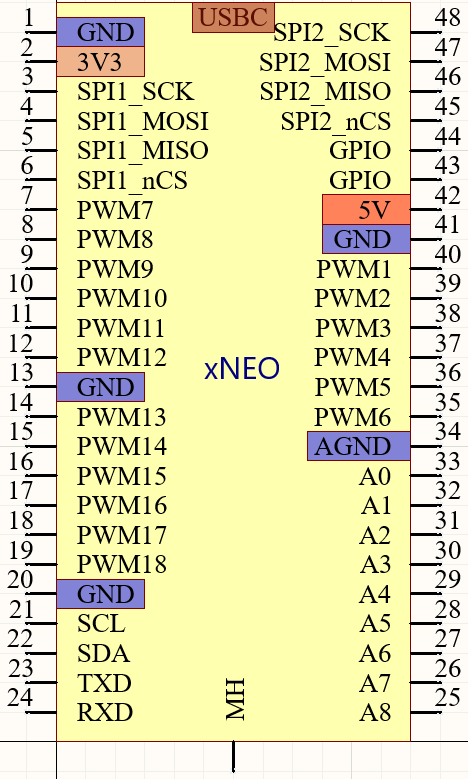

# xNeo 规范

[天在水](heguolin@mail.iee.ac.cn)@2022/05/20

## 目标

设计一种方便电控平台实验的新的PCB布局规范(PCB specs for motor control)，以高效率的进行PCB的设计和复用。

xNEO接口还不稳定，稳定后会发布v1版本(release)。

## xNEO(xNEO-48)

1. USBC 供电；
2. DIP48，双单排针，排内100mil间距，双排间距1000mil；
3. I2C上拉5.1k；
4. 板载两个2 BTN(BOOT/USER BTN, nRST BTN)，一个电源LED；
5. 建议：板载CAN通信(可以不隔离,兼容CAN 2.0B)的PHY芯片；
6. 9个ADC引脚（A0-A8）：
  - 建议：尽量保证(A1, A2), (A3, A4), (A5, A6), (A7, A8)可以进行同步采样；
  - 建议：如果支持差分，尽量保证(A1, A2), (A3, A4), (A5, A6), (A7, A8)可以进行差分采样；
  - 建议：如果有空间，板载运放缓冲（100Ω和1nF阻容负载）；
  - 建议：运放前级预留上拉电阻（方便测试PT1000等）；

## xNEO-36

1. USBC 供电；
2. DIP36，双单排针，排内100mil间距，双排间距800mil；
3. I2C上拉5.1k；
4. 板载两个2 BTN(BOOT/USER BTN, nRST BTN)，一个电源LED；
5. 建议：板载CAN通信(可以不隔离,兼容CAN 2.0B)的PHY芯片；
6. 7个ADC引脚（A0-6）：
  - 建议：尽量保证(A1, A2), (A3, A4), (A5, A6)可以进行同步采样；
  - 建议：如果支持差分，尽量保证(A1, A2), (A3, A4), (A5, A6)可以进行差分采样；
  - 建议：如果有空间，板载运放缓冲（100Ω和1nF阻容负载）；
  - 建议：运放前级预留上拉电阻（方便测试PT1000等）；

## xNEO-24

1. USBC 供电；
2. DIP24，双单排针，排内100mil间距，双排间距600mil；
3. I2C上拉5.1k；
4. 板载两个2 BTN(BOOT/USER BTN, nRST BTN)，一个电源LED；
5. 建议：板载CAN通信(可以不隔离,兼容CAN 2.0B)的PHY芯片；
6. 3个ADC引脚：
  - 建议：尽量保证(A1, A2)可以进行同步采样；
  - 建议：如果支持差分，尽量保证(A1, A2)可以进行差分采样；
  - 建议：板载运放缓冲（100Ω和1nF阻容）；
  - 建议：运放前级预留上拉电阻（方便测试PT1000等）；

## xNEO-16

1. USBC 供电；
2. DIP16，双单排针，排内100mil间距，双排间距600mil；
3. I2C上拉5.1k；
4. 板载两个2 BTN(BOOT/USER BTN, nRST BTN)，一个电源LED；
5. 建议：板载CAN通信(可以不隔离,兼容CAN 2.0B)的PHY芯片；
6. 3个ADC引脚：
  - 建议：尽量保证(A1, A2)可以进行同步采样；
  - 建议：如果支持差分，尽量保证(A1, A2)可以进行差分采样；
  - 建议：板载运放缓冲（100Ω和1nF阻容）；
  - 建议：运放前级预留上拉电阻（方便测试PT1000等）；

## 设计考虑

1. 能插入面包版:
    排针间距1000mil，常见面包版只能留出来一排过孔，但如果改为900mil或更小，对于较大的DSP芯片（比如TMS320F28388D），PCB很难绘制。为方便测试，建议购买较大的面包板（或者两块面包板拼接）。

2. 更多的ADC通道:
    这也是我放弃feather等规范的原因：引脚太少，ADC更是少得可怜；

3. 方面外接屏幕(SPI, I2C屏幕):
    直接对插常见的SPI TFT屏幕和I2C OLED屏幕。

4. 单面排针可以进行一个三相电机的控制:
    只用一排排针，即可完成一个三相电机的控制。
