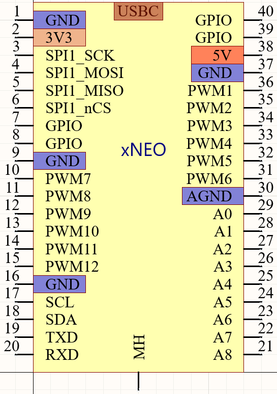

# xNeo 规范

[天在水](heguolin@mail.iee.ac.cn)@2022/07/01

## 目标

设计一种方便电控平台实验的新的PCB布局规范(PCB specs for motor control)，以高效率的进行PCB的设计和复用。

xNEO v1.0已经发布，以后的修改不会破坏对v1.0的兼容性。

## 设计标准

- 接插件采用2.54mm(100mil)间距排针，方面插入面包板使用；
- USBC 供电；
- 包括SPI、串口、I2C(上拉5.1k，只有xNEO-16没有I2C)、PWM、ADC等（具体IO规范参考下面的示意图以及AltiumLibrary中的原理图和PCB库）；
- 板载两个2 BTN(BOOT/USER BTN，nRST BTN)，一个电源LED；

建议但不强求：
- 板载CAN通信(可以不隔离，兼容CAN 2.0B)；
- 板载JTAG、SWD调试功能；
- ADC引脚(从A0开始递增序号，A0, A1, A2...)：
  - 尽量保持(A1, A2), (A3, A4)...可以同步采样；
  - 如果支持差分，尽量保证(A1, A2), (A3, A4)...可以进行差分采样；
  - 板载运放缓冲（100Ω和1nF阻容负载）；
  - 运放前级预留上拉电阻（方便测试PT1000等）；

### xNEO-48(间距1000mil)

### xNEO-40(间距900mil)

### xNEO-32(间距800mil)

### xNEO-24(间距700mil)

### xNEO-16(间距600mil)

## 设计考虑

1. 每隔8pin，设计一个标准；
   
1. 方便插入面包板测试:
    只有标准xNEO（xNEO-48）较大，排针间距1000mil，常见面包板只能留出来一排过孔，但如果改为900mil或更小，对于较大的芯片（比如TMS320F28388D），PCB很难绘制。
    
    为方便测试，建议购买较大的面包板（或者两块面包板拼接）。
    
2. 更多的ADC通道:
    这也是我放弃feather等规范的原因：引脚太少，ADC更是少得可怜；
    
3. 方面外接屏幕(SPI, I2C屏幕):
    直接对插常见的SPI TFT屏幕。
    
4. 单面排针可以进行一个三相电机的控制:
    尽量只用一排排针，即可完成一个三相电机的控制。xNEO-48理论上可以支援两个PMSM控制（包括双旋变），此时需要特殊考虑一下故障信号和温度采样（引脚不足）：
    
    - 故障信号用FPGA等芯片综合，用一个中断引脚+SPI/Serial进行通信；
    - 温度采样用I2C进行扩展；
